* * * * *

for

E-COMMERCE WEBSITE

Prepared by : 1. Revanth Thota (190001063)
2. Nitin Makula (190001033)
3. SaiRam Kola(190001026)
4. Aakash Kondampally(190001028)
5. Abhiram Khajjayam(190001025)

Submitted to : Dr.Puneet Gupta
Proffesor

Developer Implementation Manual
===============================

Prerequisites
-------------

-   1.Python(version 3.0 or newer)

-   2.Node.js(version 13.0 or newer)

-   3.Postgres SQL(version 11 or newer)

-   4.A Text Editor(preferably Visual Studio Code)

-   5.Git9version (2.20.0 or newer)

-   6.GitHub Desktop

These does not need any special installation process particular to this project.

Downloading The GitHub Repo
---------------------------

You can access the Github Repo from the following link “ https://github.com/supersaiyan1033/cavern ” You can clone the repository from Github into local storage

Different sections of Website
-----------------------------

We have frontend and backend for the website and and you can find the source code for both individually. Locate the project folder which you have cloned from Github.After you enter the project Folder you can find two Folders “Frontend” and “Backend”. Frontend folders contains the sourcecode for the reactJS section of the website and backend contains the source code for the django part of the website.

Setting up the Backend and Frontend server
------------------------------------------

As we are Using Django and React as backend and frontend frameworks respectively, we need to run both the servers in order to access the website.

-   Running the Backend Server Open command prompt and enter the following command

    1.  cd directory/projectfilename/env/Scripts/activate 
    Here the directory indicates the parent directory where the project folder has been downloaded this activates the virtual environment.

    2.  pip -r install requirements.txt 
    This command install all the necessary packages required for the project in the environment.All the necessary packages along with the version are mentioned in the requirements.txt file Enter the following command twice

    3.  cd .. 
    This navigates to the previous directory Later on

    4.  cd backend 
    Next

    
    6.  python manage.py runserver 
    This succesfully runs the django server

-   Running the Frontend Server Open another window of command Prompt run the following command

    1.  cd directory/projectfilename/frontend 
    later on

    2.  npm install 
    this installs all the packages needed to run the react server\>these are not posted in Github Repo as it takes time and data to upload and download the source code.

    3.  npm start 
    This runs the server and the website is automatically opened in the browser. This completes the setup of the website.

User Manual
===========

Opening the Website
-------------------

you can open the website by visiting the link “ ” A browser in any operating System can successfully run the website. After entering the URL given above you will be redirected to the home page of website.

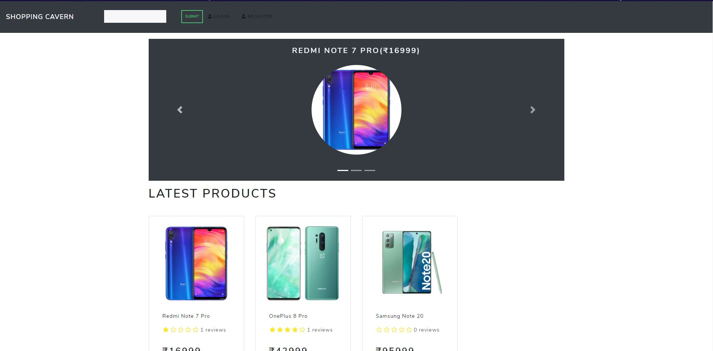

Registering in the Website
--------------------------

As you are a new costumer to the website you need to register first in order to avail the services of the website. You can click on **register** on the navigation bar located at the top.This redirects to the Sign up Page. You are required to fill few details of yours which are necessary.After filling the form you click on Register which logins you automatically and takes to product-home page.Please remember the email and password as they will be used for logging in the website later.

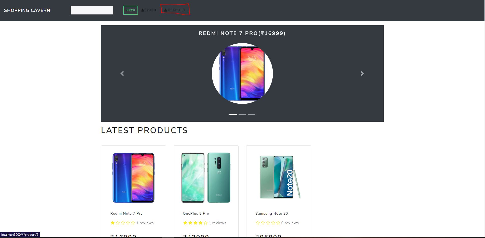

Logging in to the website
-------------------------

For the first time after registering you will be logged in automatically but for later use i.e. to login into the website you need to click on login on the navigation bar on the top in the home page of the website. this redirects you to login page where you need to enter your email and password in order to access user-specific functionalities. Caution : please select **buyer** in role as other roles are irrelevant and unnecessary for customers

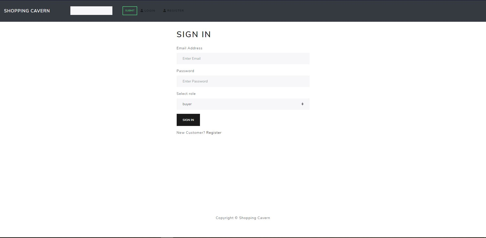

Updating the profile
--------------------

You can update some details of your Profile from “My Profile” section.You can find the My profile section from the drop-down when you click the name on the navigation bar.After clicking On MY Profile You will be navigated to New Page where You will find a form where you can fill your new details and click Update So that your Profile is updated.

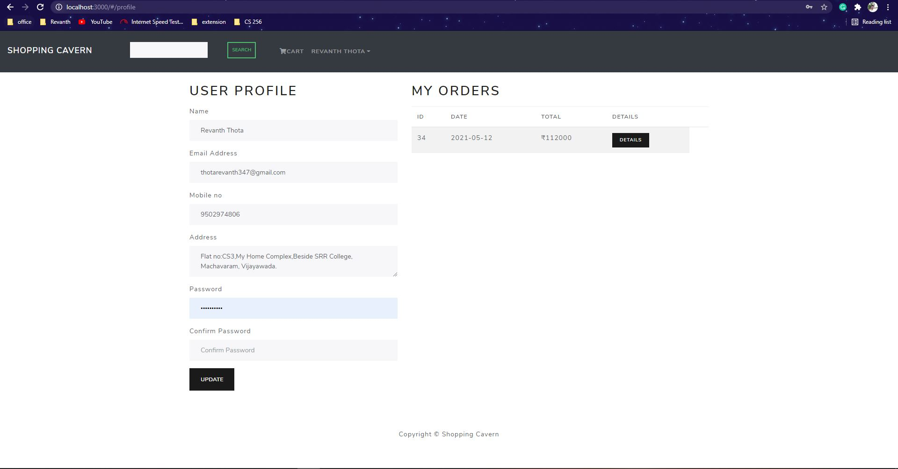

Searching a Product
-------------------

After logging in to the website, you can view a lot of variety of products and you can search a particular product by its name and its related results are displayed to you.

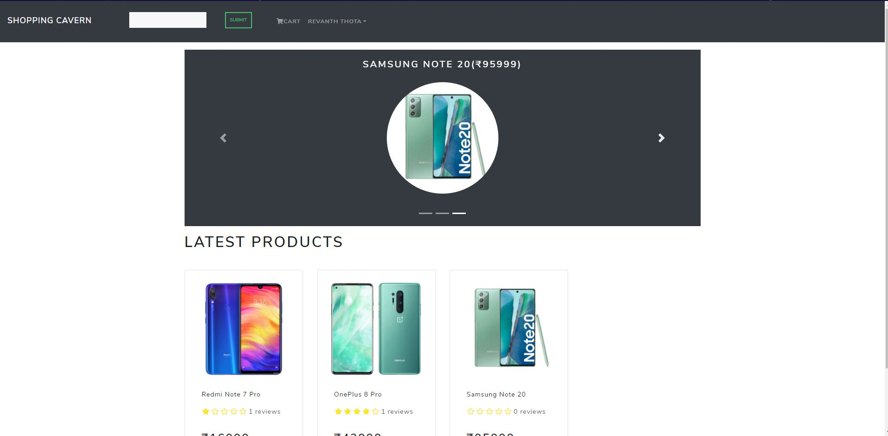

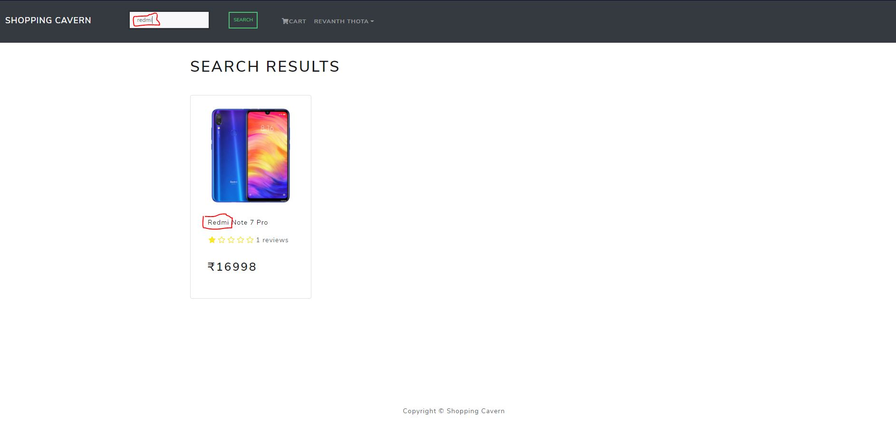

Viewing a Particular Product
----------------------------

To Select a Particular Product from the search Results,you can click on the product,this redirects you to specific product page where you can see the rating and reviews of the product and you can read the description of the product.You can select the quantity of the product and them into the cart.You can also rate and review the product(only once).You can check the status of the stack whether the stock is “available” or “out of stock”.

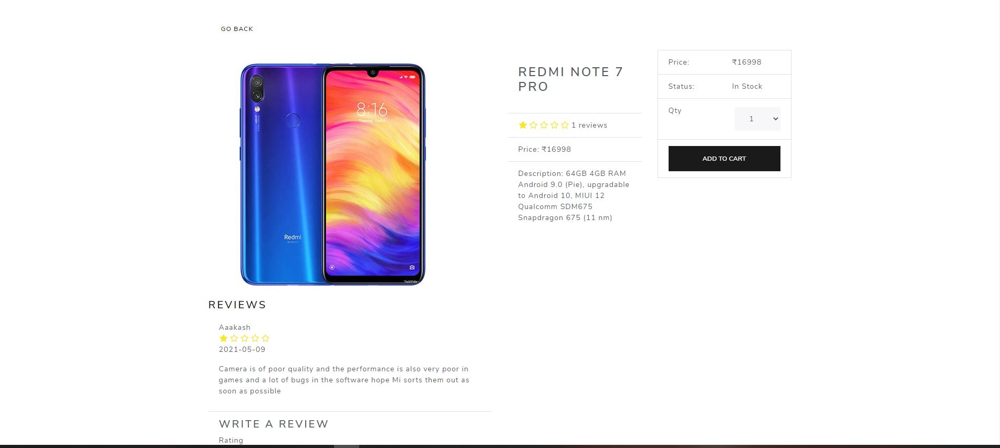

Placing an Order
----------------

After adding all the necessary Products to the cart.You can go to the cart by clicking on “Cart” in the navigation bar.You will be navigated to cart where you can find the products you have added to cart along with the quantity associated with them.You can increase the quantity associated with particular product based on demand.After checking all the details(price of each product,total price of the order),you can click on **“Proceed to checkout”** to place the Order.You will be asked to login if you aren’t logged in the website.Later on you need to fill the shipping address,in the next step you will be asked the mode of payment(as of now only COD is available because this is college project we didn’t associate it with real currency)and in the last page you can review all the details you have filled and can navigate to any part of the process with the help of tabs present at the top.Click on **“Place Order”** to complete the procedure.

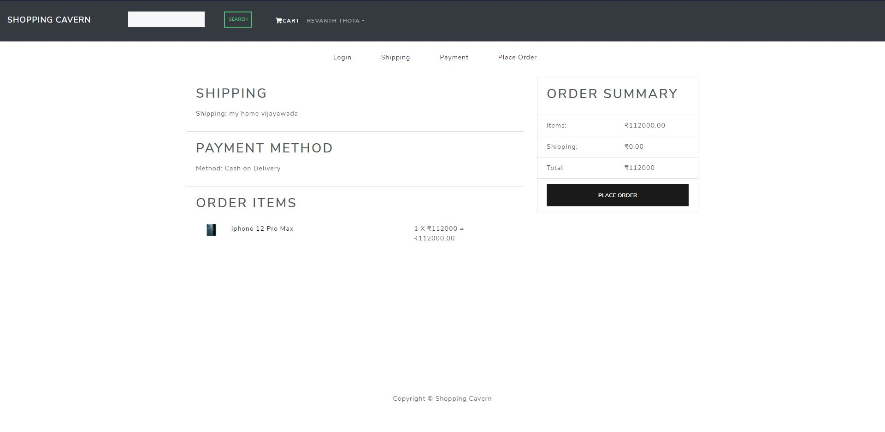
After this step you will be shown the order summary which can also be viewed on MY Orders.

Checking Orders in MY Orders
----------------------------

After you place an order you can see the details of the Orders placed in “My orders”.My Orders is located in Profile Section which can be accessed by a drop down which appears when you click on the name located on the navigation bar In the My Orders section You can find the details of your Order such as Order ID,Date Of Order Placement,Total Amount.To view in Detail,You can click on **“Details”** button which redirects you to Order Summary Page where you can view all the details of that particular Order and You can cancel the Order if you wish to.

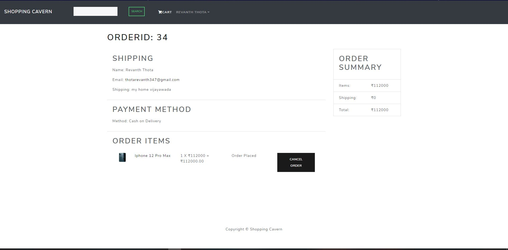 

Cancelling an Order
-------------------

You can Cancel the Order from the Order Summary page. In the Order summary Page You can find “Cancel Order” Button which you can click if you wish to cancel the Product.After Clicking the button The Order gets cancelled and you can see the updated status of the order as “cancelled”.You can still find this order in MY profile section but when you go through details you can find that the Order is cancelled.

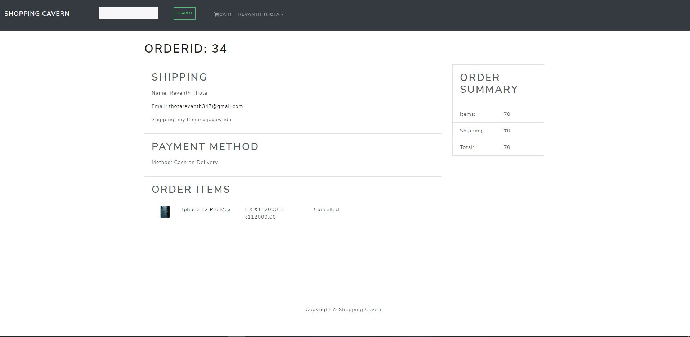

Logging Out
-----------

After completing the necessary actions the user needs to log-out from the website we can do so by selecting “Logout” from the drop-down which appears on clicking name present on the navigation bar. after clicking logging out he will be redirected to home page where the access to user specific functionalities is restricted.

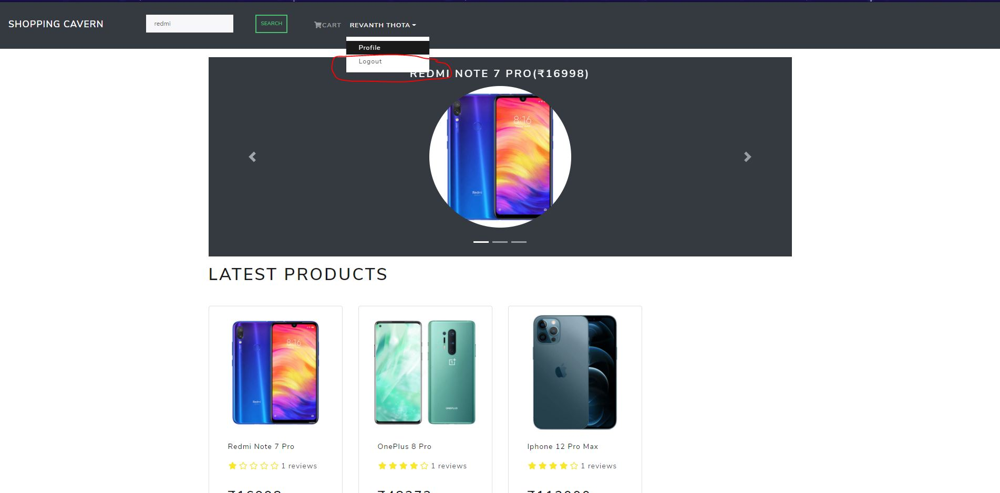

